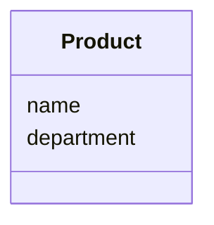
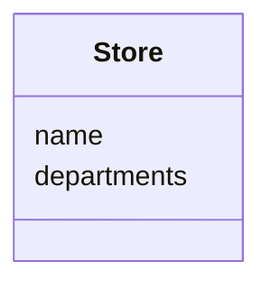
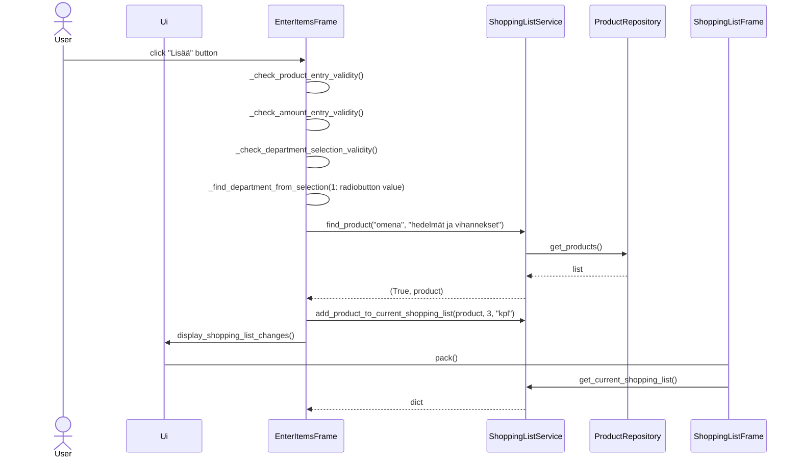

# Arkkitehtuurikuvaus

### Rakenne

Ohjelman rakenne on neljässä tasossa. Koodin pakkausrakenne on seuraava:


Pakkaus nimeltä UI vastaa käyttöliittymän koodista. Services-pakkaus vastaa sovelluslogiikasta. Repositories-pakkaus vastaa pysyväistallennukseen liittyvästä koodista ja Entities-pakkaus vastaa sovelluksessa käytössä olevista oliosta. 

### Käyttöliittymä

Käyttöliittymässä on yksi näkymä, joka on jaoteltu kolmeen osioon: 

- Valinnat 
- Kauppalista 
- Tuotteiden lisäys


Kukin näistä on toteutettu omana luokkanaan. UI-luokka vastaa osioiden pakkaamisesta järjestyksessä. Käyttöliittymä on pyritty eristämään täysin sovelluslogiikasta. Käyttöliittymä kutsuu ShoppingListService-luokan metodeja.

### Sovelluslogiikka

Luokat Product ja Store muodostavat sovelluksen perusyksiköt. Product-olio kuvaa tuotteen tietoja:


Store-olio kuvaa kaupan tietoja:


Sovelluksen toiminnallisesta kokonaisuudesta vastaa ShoppingListService-luokka. ShoppingListService-olio tarjoaa käyttöliittymälle metodit, joita se tarvitsee kullekkin toiminnolle. Esimerkkejä ovat:

- get_current_shopping_list()
- find_product(product_entry, department)    
- create_new_product(product_name, department)
- add_product_to_current_shopping_list(product, amount, unit)
- delete_product_from_shopping_list(product, unit)

Repositories-pakkauksessa sijatsevat ProductRepository, ShoppingListRepository ja StoreRepository tarjoavat ShoppingListService-oliolle pääsyn Product- ja Store-olioihin. ProductRepository ja StoreRepository-luokat tarjovat ShoppingListService-oliolle pysyväistallennuksen perusyksiköiden tiedoista. ShoppingListRepository-luokka tarjoaa käyttäjälle kauppalista-tiedoston pysyväistallennuksen. Luokkien toteutukset injektoidaan sovelluslogiikalle konstruktorikutsun yhteydessä.

Ohessa pakkauskaavio, joka kuvaa ShoppingListService-luokan suhdetta ohjelman muihin osiin:


### Tietojen pysyväistallennus

Repositories-pakkauksessa sijatsevat ProductRepository ja StoreRepository ovat vastuussa tietojen pysyväistallennuksesta. Nämä tallentavat tiedot CSV-tiedostoihin. ShoppingListRepository vastaa "Kauppalista"-tekstitiedoston luonnista ja tallennuksesta. 

Luokat pyrkivät noudattamaan Repository -suunnittelumallia.  Luokat voidaan tarvittaessa korvata uusilla toteutuksilla, esimerkiksi SQL-tietokannoilla. Sovelluslogiikan testauksessa käytetään tiedostoon ja tietokantaan tallentavien olioiden sijaan keskusmuistiin tallentavia toteutuksia.

#### Tiedostot

Sovellus tallettaa tuotteiden ja kauppojen tiedot erillisiin tiedostoihin. 

Sovelluksen juureen sijoitettu konfiguraatiotiedosto [.env](././.env) määrittelee tiedostojen nimet.

Sovellus tallettaa tehtävät CSV-tiedostoon seuraavassa formaatissa:

```
vehnäjauho;kuivatuotteet
vaniljajäätelö;pakasteet
```
Eli ensimmäiseksi tuotteen nimi ja sitten tuotteen osasto. Kenttien arvot erotellaan puolipisteellä (;).

### Päätoiminnallisuudet

Seauraava sekvenssikaavio kuvaa sovelluksen toimintalogiikkaa erään päätoiminnallisuuden osalta:

#### Tuotteen lisääminen kauppalistalle

Kun tuotekentään kirjoitetaan tuote ja tämän jälkeen klikataan _Lisää_, etenee sovellus seurvaasti:


Painikkeseen reagoiva tapahtumankäsittelijä ensin tarkistaa syötteiden oikeellisuuden kutsumalla sen omia metodeja _check_product_entry_validity_, _check_amount_entry_validity_ ja _check_department_selection_validity_. Kun syötteet ovat oikein, käyttöliittymän luokka `EnterItemsFrame` kutsuu sen omaa metodia _find_department_from_selection_ valintapainikkeen arvolla. Tämän jälkeen `EnterItemsFrame` kutsuu sovelluslogiikan `ShoppingListService` metodia _find_product_ tuotekenttään syötyllä arvolla ja valitulla osastolla. Sovelluslogiikka kutsuu `ProductRepository` tietokannan metodia _get_products()_, joka palauttaa listan tietokannassa olevista tuotteista. Sovelluslogiikka `ShoppingListService` etsii syötettyjen arvojen perusteella oikean tuotteen tuotelistasta. Ja palauttaa käyttöliittymän luokalle `EnterItemsFrame` tuplen, jonka ensimmäinen arvo on True, koska tuote löytyi tietokannasta, ja toinen arvo on itse tuote. Tämän jälkeen `EnterItemsFrame` kutsuu `ShoppingListServicen` metodia _add_product_to_current_shopping_list_ parametreinään tuote, määrä ja yksikkö. `EnterItemsFrame` kutsuu `Ui`-luokkaa _display_shopping_list_change_ metodilla. `Ui`-luokka kutsuu `ShoppingListFrame`-oliota metodilla _pack()_, joka hakee päivitetyn kauppalistan `ShoppingListService`ltä metodilla _get_current_shopping_list()_. 

### Ohjelman rakenteeseen jääneet heikkoudet

Ohjelman perusyksiköiden olioita Product ja Store sekä niitten pysyväistallennusta voisitaisiin jatkokehittää. 
- Product-olion yksilöivä tunniste ja sen tallentaminen tietokantaan auttaisi yksilöimään eri tuotteet toisistaan. 
- Sovelluksessa ei ole ominaisuuksia, jotka hyötyvät Store-olion tarjoamista ominaisuuksista. 
- Kolmas käsite, jota sovellus hyödyntää, osasto/department on toteutettu merkkijonojen avulla. Sen erottaminen omaksi olioksi auttaisi yksilöimään osastot ja tarjoaisi hyödyllisiä ominaisuuksia sovelluslogiikalle.