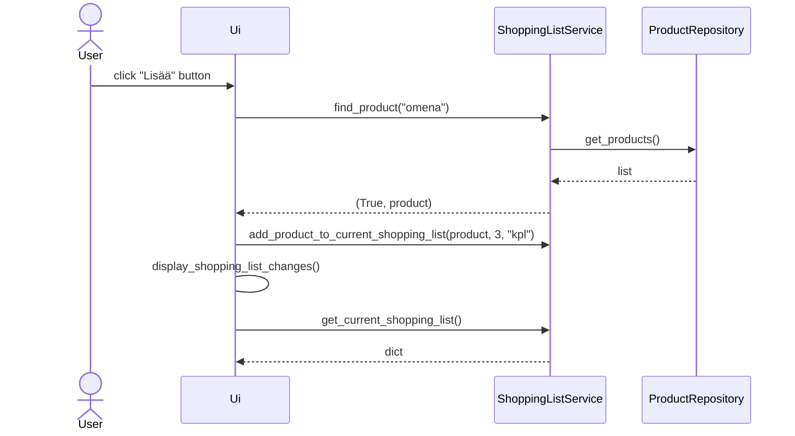

# Arkkitehtuurikuvaus

### Rakenne

Ohjelman rakenne on neljässä tasossa. Koodin pakkausrakenne on seuraava:

Pakkaus nimeltä UI vastaa käyttöliittymän koodista. Services-pakkaus vastaa sovelluslogiikasta. Repositories-pakkaus vastaa pysyväistallennukseen liittyvästä koodista ja Entities-pakkaus vastaa sovelluksessa käytössä olevista oliosta. 

### Käyttöliittymä

### Sovelluslogiikka

### Tietojen pysyväistallennus

### Päätoiminnallisuudet

Seauraava sekvenssikaavio kuvaa sovelluksen toimintalogiikkaa erään päätoiminnallisuuden osalta:

#### Tuotteen lisääminen kauppalistalle

Kun tuotekentään kirjoitetaan tuote ja tämän jälkeen klikataan _Lisää_, etenee sovellus seurvaasti:

### Ohjelman rakenteeseen jääneet heikkoudet
