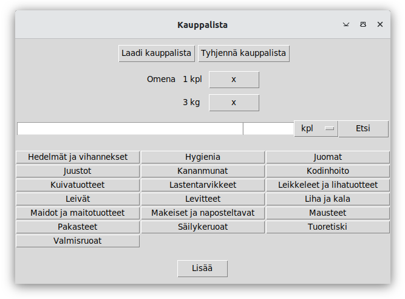

# Käyttöohje

Lataa projektin viimeisimmän [releasen]() lähdekoodi valitsemalla _Assets_-osion alta _Source code_.

### Konfigurointi

Tallennukseen käytettävien tiedostojen nimiä voi konfiguroida käynnistyshakemistossa _.env_-tiedostossa. Kun ohjelma käynnistetään tiedostot luodaan automaattisesti _data_-hakemistoon, jos niitä ei siellä vielä ole. Tiedoston muoto on seuraava:

```
PRODUCT_REPOSITORY = products.cvs
STORE_REPOSITORY = stores.cvs
SHOPPING_LIST = kauppalista.txt
```

### Ohjelman käynnistäminen

Ennen ohjelman käynnistämistä, asenna riippuvuudet komennolla:

```bash
poetry install
```

Ja käynnistä ohjelma komennolla:

```
poetry run invoke start
```
### Tuotteen hakeminen

Sovellus käynnistyy seuraavaan näkymään:


Tuotteen hakeminen onnistuu kirjoittamalla tuote ensimmäiseen syötekenttään ja painamalla joko "Etsi"-painiketta tai Enter-näppäintä. Jos tuotetta ei sellaisenaan löydy tai tuote löytyy useammalta osastolta, näkymä antaa tuote-ehdotuksia annetun syötteen mukaan:


Painamalla tuote-ehdotusta, ohjelma täyttää tuotteen tiedot syötekenttiin.

### Tuotteen lisääminen listalle

Täytä ensimmäiseen syötekenttään tuotteen nimi ja seuraavaan syötekenttään tuotteen määrä kokonaislukuna. Valitse määrän yksikkö pudotusvalikosta ja tuotteen osasto valintanapeista. Tuotteen lisääminen kauppalistalle onnistuu painamalla "Lisää"-painiketta tai Control- ja Enter-näppäintä samaan aikaan. 


### Tuotteen poistaminen listalta

Kauppalistalla olevia tuotteita voi poistaa painamalla määrän vieressä olevaa "x"-painiketta.



Jos kaikki määrät tuotetta poistetaan, tuote poistuu kauppalistalta.

### Kauppalistan tyhjetäminen

Tyhjennä kauppalista painamalla "Tyhjennä kauppalista"-painiketta.

### Kauppalista-tiedoston laatiminen

Luo kauppalistasta tekstitiedosto painamalla "Laadi kauppalista"-painiketta. Ohjelma luo kauppalistasta tiedoston, jossa on listattuna kaikki kauppalistan tuotteet siinä järjestyksessä kuin ne löytyvät kaupassa. Tiedosto tulee data-kansion alle. Ohjelma avaa kyseisen tiedoston käyttöjärjestelmän oletusohjelmalla.


