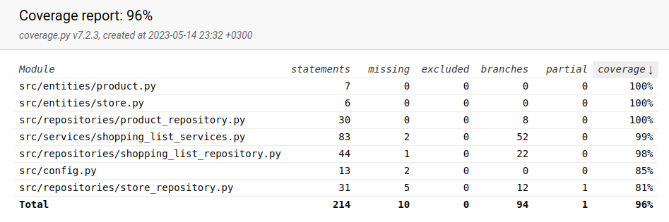

# Testausdokumentti

Ohjelmaa testaus toteutettiin automatisoiduin yksikkö- ja integraatiotestein unittestilla. Lisäksi ohjelmaa testattiin manuaalisesti järjestelmätason testeillä.

### Yksikkö- ja integraatiotestaus

#### Sovelluslogiikka

Sovelluslogiikasta vastaavaa `ShoppingListService`-luokkaa testattiin [TestShoppingListService](https://github.com/cameocami/ot-harjoitustyo/blob/main/src/tests/services/shopping_list_service_test.py)-testiluokalla. `TestShoppingListService`-olion alustuksessa sille injektoitiin riippuvuksiksi repositorio-olioiden jäljitelmät `FakeProductRepository`, `FakeStoreRepository` sekä `FakeShoppingListRepository`. Nämä jäljitelmät tallentavat tietoa väliaikaismuistiin eivätkä pysyväistallennukseen.

#### Repositorio-luokat

Repositorio-luokkia `ProductRepository` ja `StoreRepository` testattiin erillisillä, ainoastaan testeihin luoduilla tiedostoilla. Tiedostojen nimet on konfiguroitu [.env.test](https://github.com/cameocami/ot-harjoitustyo/blob/main/.env.test)-tiedostoon. `ProductRepository`-luokkaa testataan [TestProductRepository](../src/tests/repositories/product_repository_test.py)-testiluokalla ja `StoreRepository`-luokkaa [TestStoreRepository](../src/tests/repositories/store_repository_test.py)-testiluokalla.

#### Testauskattavuus

Käyttöliittymäkerrosta lukuunottamatta sovelluksen testauksen haarautumakattavuus on x%

### Järjestelmätestaus

Sovelluksen järjestelmätestaus on suoritettu manuaalisesti.

#### Asennus ja konfigurointi

Sovellus on haettu ja asennettu [käyttöohjeen](./kayttoohje.md) kuvaamalla tavalla sekä Windows- että Linux-ympäristöön.

#### Toiminnallisuudet

Kaikki [määrittelydokumentin](./vaatimusmaarittely.md#perusversion-tarjoama-toiminnallisuus) ja käyttöohjeen listaamat toiminnallisuudet on käyty läpi. Toiminnallisuuksia on testattu myös virheellisillä arvoilla syötekentissä. 

### Sovellukseen jääneet laatuongelmat

Sovellus ei tällä hetkellä anna järkeviä virheilmoituksia, kun:
- Konfiguraation määrittelemiin tiedostoihin ei ole luku/kirjoitusoikeuksia
- Käyttäjä syöttää pelkkiä/liikaa välilyöntejä

Virheilmoituksia ei ole toteutettu Pythonin "raise ...Error" ominaisuudella. 
