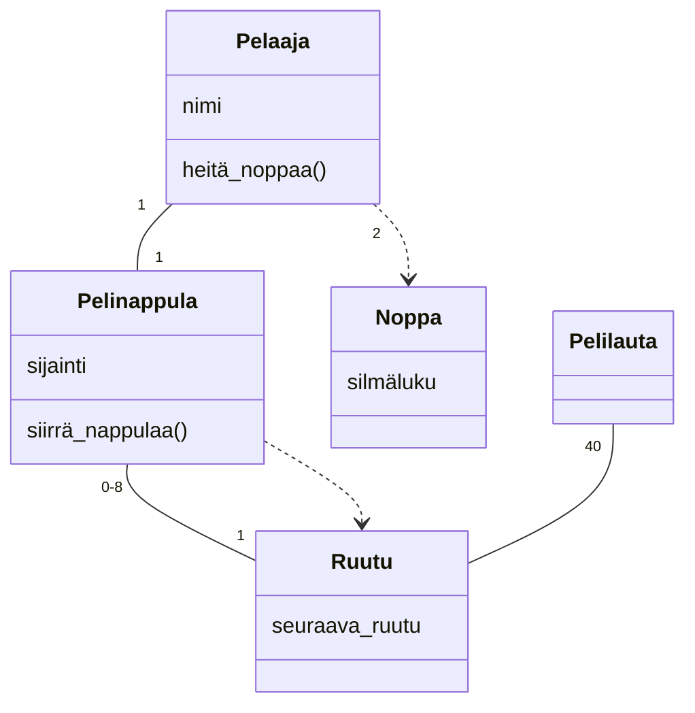

# Tehtävä 1

```mermaid
 classDiagram
      Pelaaja "1" -- "1" Pelinappula
      Pelaaja "2" ..> Noppa
      
      Pelinappula "0-8" -- "1" Ruutu
      Pelinappula ..> Ruutu
      
      Pelilauta "40" -- Ruutu
      
      
      
      class Noppa {
      silmäluku
      
      }
      
      class Pelaaja {
          nimi
          heitä_noppaa()
      }
      
      class Pelinappula {
          sijainti
          siirrä_nappulaa()
      }
      
      class Ruutu {
          seuraava_ruutu
      }
      
      class Pelilauta {
      }
```
