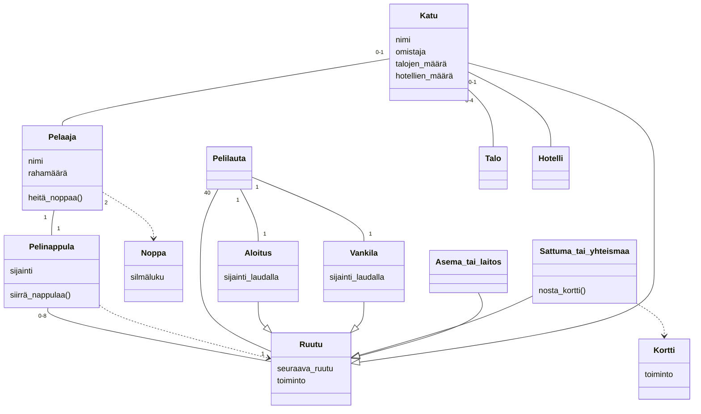

```mermaid
 classDiagram
      Pelaaja "1" -- "1" Pelinappula
      Pelaaja "2" ..> Noppa
      
      Pelinappula "0-8" -- "1" Ruutu
      Pelinappula ..> Ruutu
      
      Pelilauta "40" -- Ruutu
      Pelilauta "1" -- "1" Aloitus
      Pelilauta "1" -- "1" Vankila
      
      Aloitus --|> Ruutu
      Vankila --|> Ruutu
      Sattuma_tai_yhteismaa --|> Ruutu
      Asema_tai_laitos --|> Ruutu
      Katu --|> Ruutu
      
      Sattuma_tai_yhteismaa ..> Kortti
      
      Katu "0-1" -- Pelaaja
      Katu "0-4" -- Talo
      Katu "0-1" -- Hotelli
      
      
      
      class Pelaaja {
          nimi
          rahamäärä
          heitä_noppaa()
      }
      
      class Pelinappula {
          sijainti
          siirrä_nappulaa()
      }
      
      class Noppa {
          silmäluku
      
      }
      
      class Ruutu {
          seuraava_ruutu
          toiminto
      }
      
      class Pelilauta {

      }
      
      class Aloitus {
          sijainti_laudalla
      }
      
      class Vankila {
          sijainti_laudalla
      }
      
      class Sattuma_tai_yhteismaa {
           nosta_kortti()
      }
      
      class Asema_tai_laitos {
      }
      
      class Katu {
           nimi
           omistaja
           talojen_määrä
           hotellien_määrä
          
      }
      
      class Kortti {
           toiminto
           
      }
```
