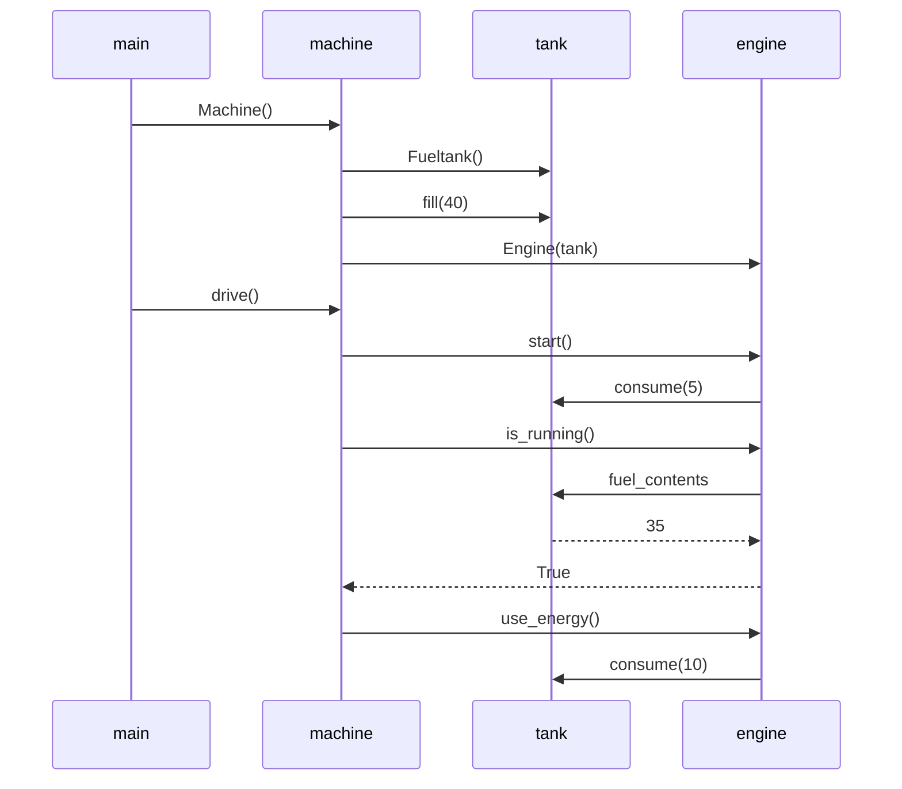

```mermaid
sequenceDiagram
  
  main->>machine: Machine()
  
  machine->>tank: Fueltank()
  machine->>tank: fill(40)
  
  machine->>engine: Engine(tank)
  
  main->>machine: drive()
  
  machine->>engine: start()
  engine->>tank: consume(5)
  
  machine->>engine: is_running()
  engine->>tank: fuel_contents
  tank-->>engine: 35
 
  engine-->>machine: True
  
  machine->>engine: use_energy()
  engine->>tank: consume(10)
  
  
```
